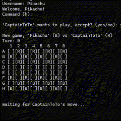

# Checkers Club C#
Example project using [Owl Tree v0.1.0](https://github.com/CaptainToTo/owl-tree).



Checkers club implements a simple server where clients can connect and challenge each other to games of Checkers. The Checkers implementation itself is not complete, but serves its purpose as an example.

## Usage

Uses .Net9, start a server with:

```
> dotnet run server
```

Start a client with:

```
> dotnet run client
```

By default, they will connect to local host. If you want to connect to a separate server, provide it's IP address as a second argument:

```
> dotnet run client 123.123.123.123
```

Once a client is connected, they will be prompted to provide a username, and then will be allowed to use several commands:

```
Checkers Club Commands:
           (h)elp: displays this message
        (p)layers: displays a list of players online
  play (username): challenge a player to a game of checkers
           (q)uit: disconnect from the server
```

To close the server, simply kill the process.